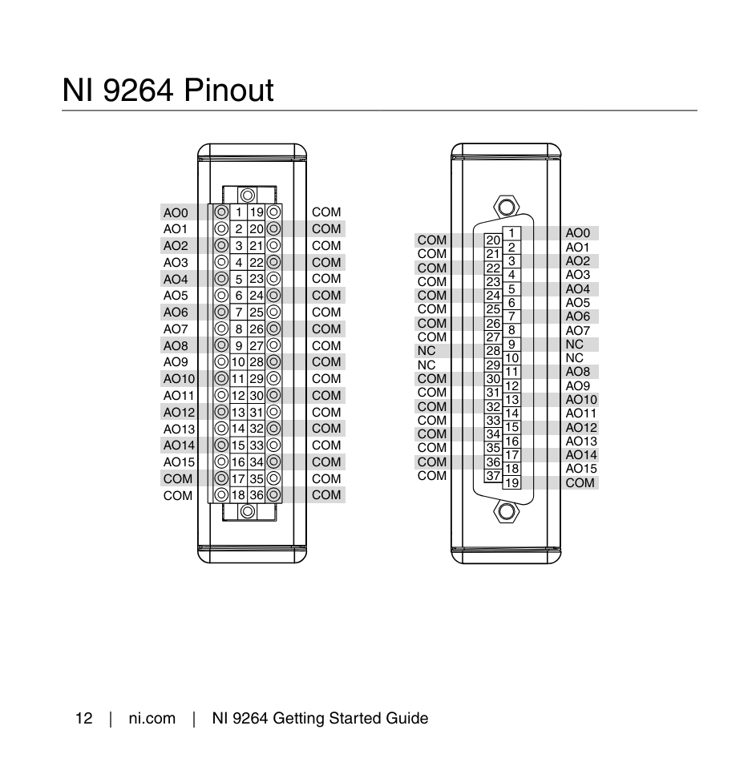

# Run flow controller 
- `python -m pipenv shell`
- `python -m marimo run snb.py`

# NI 9264
Device ID = `cDAQ1Mod1`

## Details
You can only read voltage from the `AI` channels. The 9264 diesn't have any.

## Running marimo notebook
`pipenv shell`

`pip install -r requirements.txt`

`marimo edit prop_air.py`

or on **Windows**:
`python -m pipenv shell`

`pip install -r requirements.txt`

`python -m marimo edit prop_air.txt`

## pin out

